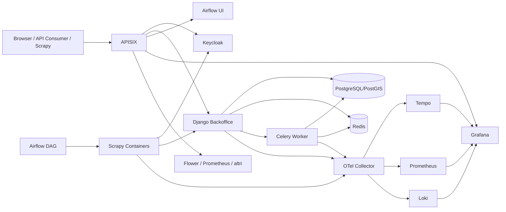
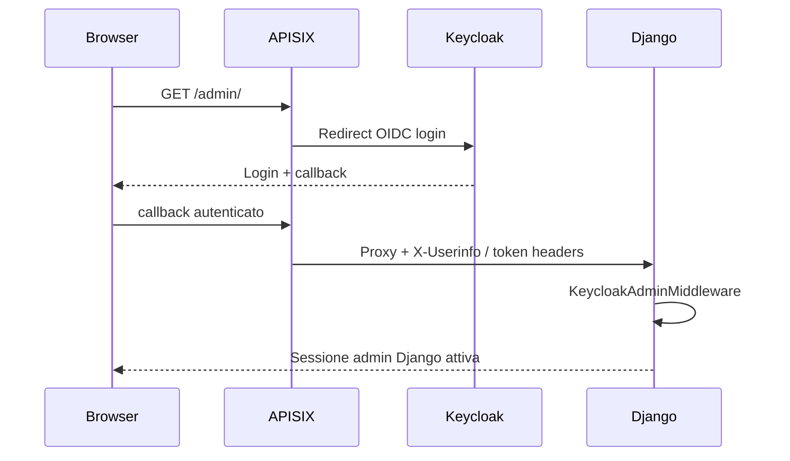
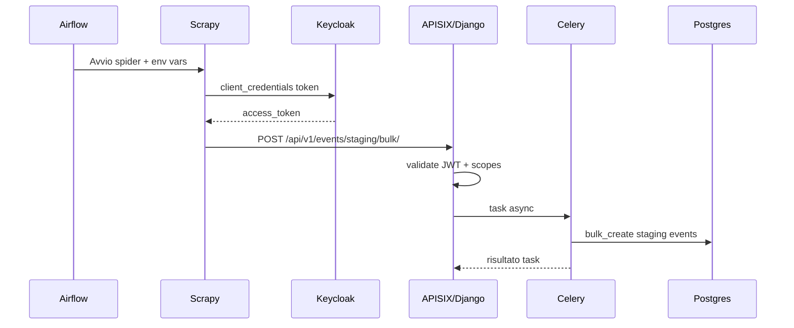
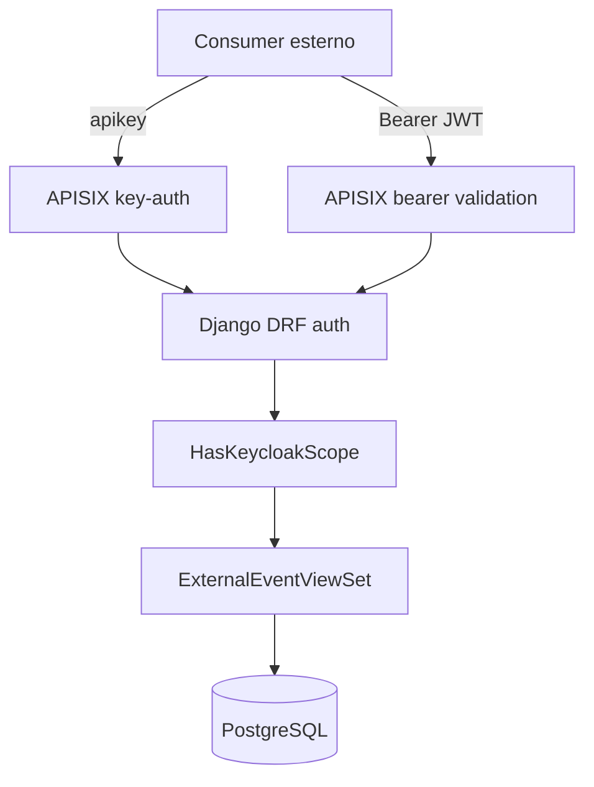

# Diagrammi Mermaid della Codebase

## Architettura generale

```mermaid
flowchart LR
    U[Browser / API Consumer / Scrapy] --> G[APISIX]
    G --> K[Keycloak]
    G --> B[Django Backoffice]
    G --> A[Airflow UI]
    G --> GR[Grafana]
    G --> F[Flower / Prometheus / altri]

    B --> P[(PostgreSQL/PostGIS)]
    B --> R[(Redis)]
    B --> C[Celery Worker]
    C --> P
    C --> R

    AF[Airflow DAG] --> S[Scrapy Containers]
    S --> K
    S --> B

    B --> O[OTel Collector]
    C --> O
    S --> O
    O --> T[Tempo]
    O --> PM[Prometheus]
    O --> L[Loki]
    T --> GR
    PM --> GR
    L --> GR
```

## Flusso SSO browser

```mermaid
sequenceDiagram
    participant Browser
    participant APISIX
    participant Keycloak
    participant Django

    Browser->>APISIX: GET /admin/
    APISIX->>Keycloak: Redirect OIDC login
    Keycloak-->>Browser: Login + callback
    Browser->>APISIX: callback autenticato
    APISIX->>Django: Proxy + X-Userinfo / token headers
    Django->>Django: KeycloakAdminMiddleware
    Django-->>Browser: Sessione admin Django attiva
```

## Flusso scraping -> bulk ingestion

```mermaid
sequenceDiagram
    participant Airflow
    participant Scrapy
    participant Keycloak
    participant APISIX/Django
    participant Celery
    participant Postgres

    Airflow->>Scrapy: Avvio spider + env vars
    Scrapy->>Keycloak: client_credentials token
    Keycloak-->>Scrapy: access_token
    Scrapy->>APISIX/Django: POST /api/v1/events/staging/bulk/
    APISIX/Django->>APISIX/Django: validate JWT + scopes
    APISIX/Django->>Celery: task async
    Celery->>Postgres: bulk_create staging events
    Celery-->>APISIX/Django: risultato task
```

## Flusso API consumer

```mermaid
flowchart TD
    C[Consumer esterno] -->|apikey| AK[APISIX key-auth]
    C -->|Bearer JWT| JW[APISIX bearer validation]
    AK --> DH[Django DRF auth]
    JW --> DH
    DH --> SC[HasKeycloakScope]
    SC --> EV[ExternalEventViewSet]
    EV --> DB[(PostgreSQL)]
```
