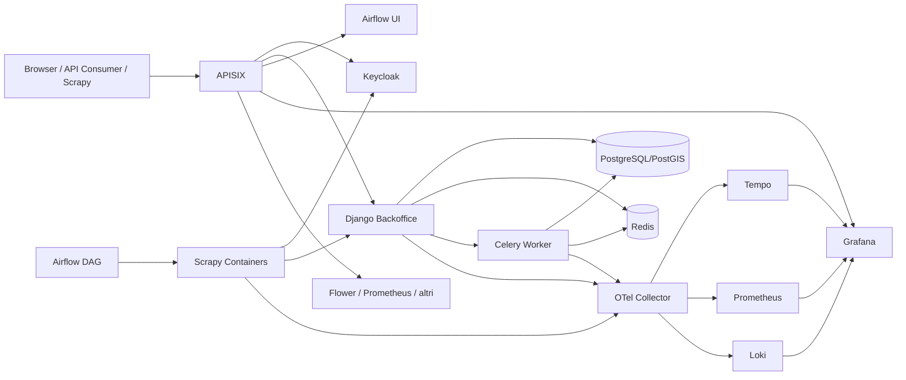
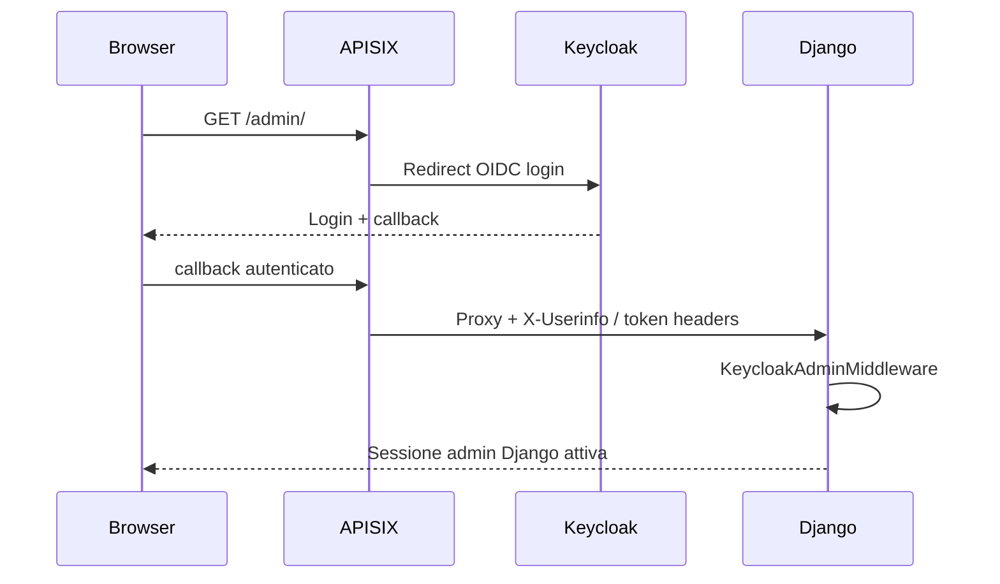
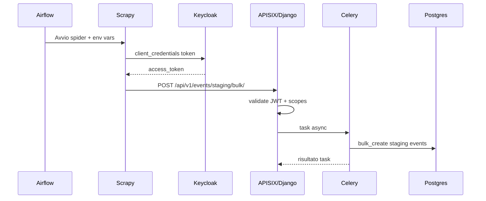
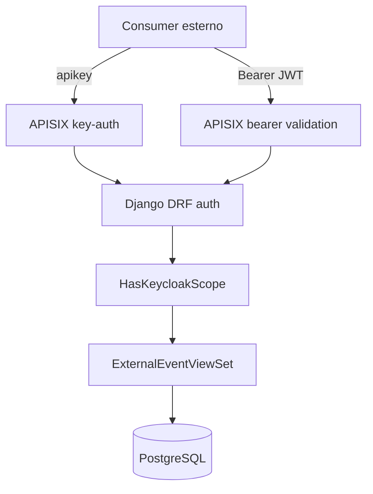

# Analisi della Codebase

## Scopo del progetto

La codebase implementa una piattaforma per:

1. raccogliere eventi da fonti italiane tramite spider Scrapy;
2. ingestire gli eventi in un backoffice Django;
3. esporre API interne ed esterne per consultazione e caricamento dati;
4. amministrare contenuti CMS e dati territoriali;
5. proteggere l'accesso con gateway APISIX + Keycloak;
6. osservare il sistema con metriche, log e tracing distribuito.

Il repository non contiene solo applicazione, ma anche buona parte dell'infrastruttura di esecuzione locale/dev e del bootstrap di sicurezza.

## Vista d'insieme

```text
Utente browser
  -> APISIX
     -> Keycloak per SSO/OIDC
     -> Backoffice Django
     -> Grafana / Airflow / Flower / altri servizi

Scrapy / Airflow
  -> Keycloak token endpoint (client credentials)
  -> APISIX route M2M o backoffice diretto
  -> Django API external
  -> PostgreSQL
  -> Celery / Redis per elaborazione async

Frontend React
  -> API CMS pubbliche del backoffice

Telemetry
  -> OTel Collector
  -> Tempo / Prometheus / Loki
  -> Grafana
```

## Componenti principali

### 1. `microservices/backoffice-service`

E' il cuore applicativo. E' un backend Django con DRF, admin, Celery e integrazioni di autenticazione.

Responsabilità principali:

- gestione eventi in staging e production;
- API interne per dashboard, ETL, contenuti e amministrazione;
- API esterne versionate per consumer e scraper;
- auto-provisioning utenti admin via Keycloak;
- validazione JWT Keycloak e permessi per scope;
- integrazione con Redis per cache e broker Celery;
- osservabilità con Prometheus e OpenTelemetry.

App Django rilevanti:

- `events`: modelli e API eventi, bulk ingestion, dashboard ETL;
- `cms`: pagine città e contenuti pubblici;
- `api_consumers`: registry dei consumer esterni, piani e permessi;
- `comuni_istat` e `comuni_italiani`: dati geografici e amministrativi;
- `etl`: storico esecuzioni e tracing applicativo;
- `ai_transform`, `nlp`: trasformazioni o enrichment dei contenuti.

### 2. `microservices/scraping-service`

Servizio Scrapy/Scrapyd per scraping eventi.

Responsabilità:

- eseguire spider per fonti diverse;
- normalizzare gli item;
- salvare batch JSON su filesystem o MinIO;
- ottenere un token OAuth2/JWT via client credentials;
- inviare i batch all'endpoint bulk del backoffice;
- propagare contesto OpenTelemetry da Airflow.

### 3. `microservices/scraping-comuni-service`

Servizio batch dedicato al scraping di dati territoriali/comunali. Non espone un servizio HTTP persistente come Scrapyd; genera file JSON che vengono poi importati nel backoffice tramite management command.

### 4. `microservices/frontend-service`

Frontend React/Vite che, allo stato attuale, appare come UI separata per homepage/feed e consumo API CMS. Non risulta il punto centrale del flusso operativo amministrativo: il backoffice Django resta il vero pannello di controllo.

### 5. `infrastructures/`

Contiene la definizione dello stack locale/dev:

- `docker-compose.dev.yml`;
- bootstrap di APISIX, Keycloak, PostgreSQL, Redis, Grafana, Prometheus, Loki, Tempo;
- DAG Airflow;
- configurazioni WAF, telemetry e route gateway.

## Flussi applicativi principali

## Flusso 1: accesso web amministrativo con SSO

Percorso:

1. l'utente apre un URL protetto, per esempio `backoffice.<domain>/admin/`;
2. APISIX intercetta la richiesta e applica il plugin `openid-connect`;
3. se non esiste sessione, APISIX redirige a Keycloak;
4. Keycloak autentica l'utente e ritorna ad APISIX;
5. APISIX crea la sessione OIDC e inietta header come `X-Userinfo`, `X-Id-Token`, `X-Access-Token`;
6. Django riceve la richiesta;
7. `KeycloakAdminMiddleware` legge `X-Userinfo`, verifica i ruoli e fa login automatico in Django;
8. se l'utente non esiste, viene creato automaticamente;
9. se ha ruolo `admin`, diventa superuser Django;
10. se ha ruolo `web`, viene mappato nel gruppo `Redazione`.

Note:

- questo flusso vale soprattutto per `/admin/`;
- le API DRF non usano questo middleware per autenticazione primaria, ma autenticazione Bearer/API key.

## Flusso 2: scraping eventi -> ingestione backoffice

Percorso end-to-end:

1. Airflow schedula o esegue container Scrapy;
2. lo spider produce item evento;
3. `ApiPipeline` accumula item in batch;
4. il batch viene salvato anche su storage locale/MinIO;
5. `ApiPipeline` richiede un access token a Keycloak con `grant_type=client_credentials`;
6. Scrapy invia `POST /api/v1/events/staging/bulk/` con `Authorization: Bearer <token>`;
7. il backoffice valida il JWT e applica i permessi;
8. il bulk può essere:
   - sincrono se `?sync=true`;
   - asincrono di default, con dispatch a Celery;
9. il worker Celery valida gli item e fa `bulk_create` su PostgreSQL;
10. Redis funge da broker e cache;
11. gli eventi restano in staging finché non vengono gestiti/pubblicati dal backoffice.

Questo è il flusso dati più importante della piattaforma.

## Flusso 3: API esterne per consumer

La piattaforma espone API versionate sotto `/api/v1/events/`.

Due modalità di autenticazione:

- API key via APISIX consumer;
- JWT Keycloak per client machine-to-machine.

Percorso tipico con JWT:

1. il consumer ottiene token da `/auth/token` o direttamente da Keycloak;
2. invia la chiamata verso `webservice.<domain>/api/external/*`;
3. APISIX valida il bearer token;
4. APISIX propaga header come `X-Consumer-Plan` e `X-Consumer-Username`;
5. Django usa `KeycloakJWTAuthentication`;
6. `HasKeycloakScope` verifica se il consumer ha il permesso richiesto, ad esempio `events:read` o `events:create`.

Percorso tipico con API key:

1. il consumer invia header `apikey`;
2. APISIX autentica il consumer con `key-auth`;
3. APISIX inietta piano e username;
4. Django usa `ApisixConsumerAuthentication`;
5. i permessi vengono ricostruiti dal record `ApiConsumer`.

## Flusso 4: frontend pubblico/CMS

Il frontend React chiama il backoffice su endpoint CMS pubblici:

- `GET /api/cms/citta/`
- `GET /api/cms/citta/{slug}/`

Queste view sono `AllowAny`, senza autenticazione. Sono quindi il read model pubblico dei contenuti editoriali.

## Flusso 5: Airflow e ruolo operativo

Airflow ha due ruoli:

- orchestration dei job di scraping;
- interfaccia operativa per osservare e lanciare DAG.

L'accesso web ad Airflow passa da APISIX + Keycloak. Airflow non decide l'identità da solo: riceve email e ruoli via header, poi mappa:

- `admin` -> ruolo Airflow `Admin`;
- `monitoring` -> ruolo Airflow `Viewer`.

Se il ruolo manca, l'utente viene bloccato o disattivato.

## Token, autenticazione e autorizzazione

## Modello complessivo

La codebase usa più livelli:

- SSO browser con OIDC tramite APISIX e Keycloak;
- JWT bearer per API machine-to-machine;
- API key APISIX per consumer semplici;
- sessione Django per l'admin, creata dopo il passaggio via gateway;
- gruppi/ruoli applicativi dentro Django e Airflow.

Non esiste quindi un solo meccanismo auth, ma una stratificazione coerente con i casi d'uso.

## Keycloak

Keycloak è l'Identity Provider centrale.

Usi principali:

- login utenti interattivi;
- emissione token client credentials;
- gestione client OIDC/M2M;
- esposizione JWKS per verifica firma JWT;
- ruoli realm usati da APISIX, Django e Airflow.

Nel backend, i JWT vengono validati contro JWKS con cache Redis di 5 minuti.

## APISIX

APISIX è il vero gate di frontiera:

- termina TLS;
- applica redirect HTTP -> HTTPS;
- esegue OIDC browser flow;
- esegue validazione bearer token;
- esegue key-auth per API key;
- applica rate limiting;
- applica CORS;
- può applicare WAF Coraza;
- arricchisce le richieste con header verso gli upstream.

In pratica è il punto in cui si decide:

- chi entra;
- con quale identità;
- con quale piano;
- con quali limiti.

## Django DRF authentication stack

Ordine rilevante:

1. `ApisixConsumerAuthentication`
2. `KeycloakJWTAuthentication`
3. `SessionAuthentication`

Implicazioni:

- se c'è un bearer token, il flusso APISIX consumer viene saltato;
- se c'è un API consumer APISIX, Django costruisce un utente logico autenticato anche senza user reale nel DB;
- se la richiesta viene dall'admin web, la sessione Django resta valida per le API interne.

## Scope e matrice permessi

L'autorizzazione applicativa più importante è nella classe `HasKeycloakScope`.

La logica è basata su scope del tipo:

- `events:read`
- `events:create`
- `events:update`
- `events:delete`

La sorgente effettiva dei permessi è il modello `ApiConsumer.api_permissions`, una matrice JSON per risorsa/azione.

Quindi:

- APISIX autentica;
- Django ricalcola o legge i permessi;
- DRF li applica per view/action.

Questo evita di delegare tutta l'autorizzazione al gateway.

## Piani consumer

I consumer hanno anche un piano:

- `free`
- `enterprise`
- `flat`

Effetti del piano:

- rate limiting in APISIX per il piano `free`;
- filtraggio campi serializer nelle API esterne;
- identificazione del tipo di consumer via claim/header.

## Ruoli applicativi

### Django admin

Ruoli Keycloak rilevanti:

- `admin`: accesso completo;
- `web`: accesso staff con gruppo `Redazione`.

### Airflow

Ruoli Keycloak rilevanti:

- `admin`: amministrazione completa;
- `monitoring`: sola lettura.

### Grafana, Flower, Prometheus, APISIX Dashboard

Sono protetti soprattutto dal gate SSO di APISIX. In alcuni casi non c'è un controllo fine-grained interno al servizio, quindi la sicurezza è delegata quasi del tutto al gateway.

## Sicurezza: cosa c'è di buono

La codebase ha già diverse misure corrette.

### 1. Separazione dei flussi auth

Browser e machine clients usano canali distinti:

- OIDC session per UI;
- bearer token/API key per API.

Questo è un buon disegno.

### 2. Validazione JWT robusta lato backend

`KeycloakJWTAuthentication` valida:

- firma RSA con JWKS;
- `exp`;
- `aud`;
- `iss`.

Accetta sia issuer interno sia pubblico, utile in ambienti dietro proxy.

### 3. Cache JWKS

Le chiavi pubbliche Keycloak vengono cachate in Redis. Riduce latenza e dipendenza forte da Keycloak a ogni richiesta.

### 4. Rate limiting gateway

APISIX applica:

- rate limiting globale di frontiera;
- rate limit specifico per token endpoint;
- limiti per consumer `free`.

### 5. Soft delete e tracciabilità

Le delete sugli eventi esterni diventano disattivazioni con audit fields come `deleted_by` e `deleted_at`.

### 6. Telemetry e audit operativo

Sono presenti:

- metriche Prometheus;
- log verso Loki;
- trace distribuiti via OTel;
- logging admin;
- test WAF/rate limiting.

Questo aiuta molto nel rilevare abuso, errore o regressioni.

### 7. Disabilitazioni prudenti lato Scrapy

`TELNETCONSOLE_ENABLED` è disabilitato di default, che è corretto per evitare superfici inutili in produzione.

## Sicurezza: rischi e debolezze osservabili

Questa sezione descrive i rischi che emergono dal repository com'è ora.

### 1. Materiale sensibile versionato nel repository

Nel repository sono presenti file che non dovrebbero stare in Git in chiaro, ad esempio:

- certificati e chiavi APISIX in `infrastructures/services/apisix/certs/`;
- chiavi Harbor/Cosign in `infrastructures/services/harbor/`;
- secret e chiavi sotto `infrastructures/services/harbor/data/secret/`;
- chiavi OCI in `infrastructures/OCI/privatekey`;
- `infrastructures/OCI/publickey`.

Questo è il rischio principale della codebase attuale. Anche se il contesto fosse "solo dev", abituare il progetto a tenere segreti nel repository è una pratica fragile.

### 2. Segreti di esempio molto vicini alla configurazione reale

La codebase contiene molti default di tipo `CHANGE_ME` o credenziali esplicite in documentazione e bootstrap. In dev va bene come template, ma il confine tra esempio e valore effettivo è sottile. Se una pipeline CI/CD o un deploy usa questi default, il rischio è alto.

### 3. Route pubblica molto ampia sul backoffice host

La route APISIX `backoffice-public` su `backoffice.<domain>` inoltra `/*` senza SSO. Questo significa che la protezione dell'area non è data dal gateway host-level, ma dal fatto che alcune sotto-route sono protette in modo più specifico o dalle permission Django.

Funziona, ma richiede molta disciplina:

- una route nuova può diventare pubblica per errore;
- un endpoint DRF configurato male può risultare esposto.

### 4. CORS globale permissivo a livello gateway

APISIX configura `allow_origins: "**"`. Anche con `allow_credential: false`, questa scelta è ampia. Può andare per API pubbliche o ambienti dev, ma è più aperta del necessario.

### 5. Session secret hardcoded in bootstrap APISIX

Nel file di init APISIX compare un secret di sessione statico. In dev è tollerabile, ma in ambienti persistenti deve essere esternalizzato e ruotabile.

### 6. WAF presente ma non completo

Il WAF Coraza è configurato con alcune regole custom utili, ma i test mostrano limiti espliciti:

- alcune classi di payload sono marcate `xfail`;
- l'ispezione del body JSON non copre tutto;
- la protezione è più "best effort" che completa.

Quindi il WAF è un ulteriore layer, non una garanzia forte.

### 7. Accesso interno molto basato su header proxy

Servizi come Grafana e Airflow si fidano degli header iniettati da APISIX. Questa è una strategia normale dietro reverse proxy, ma va garantito che:

- i servizi non siano esposti bypassando APISIX;
- gli header non siano spoofabili da altri ingress interni;
- la rete interna sia controllata.

### 8. Audience JWT semplificata

`KEYCLOAK_AUDIENCE` usa `account` come audience attesa. E' una scelta funzionante, ma meno restrittiva rispetto ad audience specifiche per servizio/client. In una piattaforma che crescerà, audience dedicate sarebbero più rigorose.

## Interazioni tra componenti

## Backoffice <-> PostgreSQL

Tutti i dati applicativi persistono in PostgreSQL/PostGIS:

- eventi;
- metadata ETL;
- utenti Django e permessi;
- contenuti CMS;
- dati comuni/province/regioni.

## Backoffice <-> Redis

Redis viene usato per:

- broker Celery;
- cache Django;
- cache JWKS e altre informazioni transienti.

## Backoffice <-> Keycloak

Interazione doppia:

- validazione token in lettura;
- API admin Keycloak per creare o aggiornare client dei consumer.

Il modulo `api_consumers` è quello che orchestra questa integrazione.

## APISIX <-> Keycloak

APISIX usa Keycloak per:

- discovery OIDC;
- browser login flow;
- validazione bearer token;
- proxy del token endpoint pubblico `/auth/token`.

## Airflow <-> Scrapy

Airflow avvia job Docker/Kubernetes che eseguono gli spider. Passa:

- credenziali API;
- endpoint token Keycloak;
- configurazione OTel;
- contesto DAG e tracing.

## Frontend <-> Backoffice

Il frontend React parla con il backoffice via fetch JSON, soprattutto per API CMS. Non emerge, dai file letti, un forte strato auth lato frontend: sembra più un frontend pubblico/editoriale che una console amministrativa completa.

## Lettura architetturale per dominio

## Dominio eventi

Il dominio più maturo è quello eventi:

- scraping;
- staging;
- validazione;
- pubblicazione;
- ranking;
- esposizione API.

L'uso di staging e bulk ingestion mostra un disegno pensato per pipeline ETL, non solo CRUD tradizionale.

## Dominio contenuti

Il CMS sembra più semplice:

- pagine città;
- navigazione;
- sezioni;
- articoli.

E' consumato dal frontend via API pubbliche.

## Dominio accesso/API consumer

Esiste un sottosistema dedicato ai consumer esterni:

- provisioning;
- piani;
- limiti;
- claim custom;
- sync verso APISIX e Keycloak.

Questo è uno dei pezzi più "platform-oriented" della codebase.

## Come leggere la codebase

Ordine consigliato:

1. `infrastructures/docker-compose.dev.yml`
2. `infrastructures/services/apisix/init-routes.sh`
3. `microservices/backoffice-service/backend/backoffice/settings.py`
4. `microservices/backoffice-service/backend/backoffice/authentication.py`
5. `microservices/backoffice-service/backend/backoffice/middleware.py`
6. `microservices/backoffice-service/backend/events/views.py`
7. `microservices/backoffice-service/backend/events/tasks.py`
8. `microservices/backoffice-service/backend/api_consumers/services.py`
9. `microservices/scraping-service/src/pipelines.py`
10. `infrastructures/services/airflow/dags/scrape_events.py`

Questa sequenza fa capire prima i confini di accesso, poi il dominio applicativo, poi il flusso dati.

## Conclusione

La codebase realizza una piattaforma ETL/editoriale con un'impostazione abbastanza solida:

- gateway centralizzato;
- identity provider dedicato;
- autorizzazione per scope;
- orchestrazione batch;
- osservabilità moderna.

Il punto forte è la chiarezza dei flussi tra gateway, identity e backend.

Il punto più delicato non è tanto la logica applicativa, ma l'igiene operativa:

- segreti e chiavi versionati;
- route pubbliche molto ampie;
- forte dipendenza da configurazione corretta del gateway.

Se vuoi, nel passo successivo posso anche produrre una seconda versione più tecnica e schematica, con diagrammi Mermaid e riferimenti file-per-file.

## Diagrammi Mermaid

### Architettura generale



### Flusso SSO browser



### Flusso scraping -> bulk ingestion



### Flusso API consumer



## Mappa file chiave

### Gateway e infrastruttura

- [infrastructures/docker-compose.dev.yml](/Users/skyweb/Sites/dev/scaraping_events/infrastructures/docker-compose.dev.yml): definisce lo stack locale e le dipendenze tra servizi.
- [infrastructures/services/apisix/init-routes.sh](/Users/skyweb/Sites/dev/scaraping_events/infrastructures/services/apisix/init-routes.sh): bootstrap di route, upstream, SSO, JWT bearer, API key, rate limiting e route pubbliche.
- [infrastructures/services/apisix/wasm/coraza.conf](/Users/skyweb/Sites/dev/scaraping_events/infrastructures/services/apisix/wasm/coraza.conf): regole WAF Coraza custom.
- [infrastructures/services/airflow/dags/scrape_events.py](/Users/skyweb/Sites/dev/scaraping_events/infrastructures/services/airflow/dags/scrape_events.py): DAG di scraping, passaggio credenziali e tracing.
- [infrastructures/services/airflow/webserver_config.py](/Users/skyweb/Sites/dev/scaraping_events/infrastructures/services/airflow/webserver_config.py): mapping ruoli Keycloak -> ruoli Airflow via auth proxy.

### Backoffice: auth e sicurezza

- [microservices/backoffice-service/backend/backoffice/settings.py](/Users/skyweb/Sites/dev/scaraping_events/microservices/backoffice-service/backend/backoffice/settings.py): configurazione Django, DRF auth stack, Keycloak, CORS, CSRF.
- [microservices/backoffice-service/backend/backoffice/authentication.py](/Users/skyweb/Sites/dev/scaraping_events/microservices/backoffice-service/backend/backoffice/authentication.py): validazione JWT, auth API key APISIX, permessi per scope.
- [microservices/backoffice-service/backend/backoffice/middleware.py](/Users/skyweb/Sites/dev/scaraping_events/microservices/backoffice-service/backend/backoffice/middleware.py): SSO admin via `X-Userinfo`, auto-provisioning utenti, logging admin.
- [microservices/backoffice-service/backend/backoffice/urls.py](/Users/skyweb/Sites/dev/scaraping_events/microservices/backoffice-service/backend/backoffice/urls.py): superficie HTTP principale del backoffice.
- [microservices/backoffice-service/backend/tests/test_keycloak_auth.py](/Users/skyweb/Sites/dev/scaraping_events/microservices/backoffice-service/backend/tests/test_keycloak_auth.py): test unit per la validazione JWT.
- [microservices/backoffice-service/backend/tests/test_waf.py](/Users/skyweb/Sites/dev/scaraping_events/microservices/backoffice-service/backend/tests/test_waf.py): test di integrazione per WAF e rate limiting.

### Backoffice: dominio eventi e consumer

- [microservices/backoffice-service/backend/events/views.py](/Users/skyweb/Sites/dev/scaraping_events/microservices/backoffice-service/backend/events/views.py): API interne/esterne, bulk ingestion, dashboard, piano/scopes.
- [microservices/backoffice-service/backend/events/tasks.py](/Users/skyweb/Sites/dev/scaraping_events/microservices/backoffice-service/backend/events/tasks.py): worker Celery per bulk e ranking.
- [microservices/backoffice-service/backend/events/urls.py](/Users/skyweb/Sites/dev/scaraping_events/microservices/backoffice-service/backend/events/urls.py): routing API interne e `/api/v1/events/`.
- [microservices/backoffice-service/backend/api_consumers/models.py](/Users/skyweb/Sites/dev/scaraping_events/microservices/backoffice-service/backend/api_consumers/models.py): piano, scadenza, permessi e metadati dei consumer esterni.
- [microservices/backoffice-service/backend/api_consumers/services.py](/Users/skyweb/Sites/dev/scaraping_events/microservices/backoffice-service/backend/api_consumers/services.py): sync dei consumer verso APISIX e Keycloak.

### Scraping

- [microservices/scraping-service/src/settings.py](/Users/skyweb/Sites/dev/scaraping_events/microservices/scraping-service/src/settings.py): configurazione Scrapy, proxy, throttling, token endpoint, output.
- [microservices/scraping-service/src/pipelines.py](/Users/skyweb/Sites/dev/scaraping_events/microservices/scraping-service/src/pipelines.py): batching, salvataggio JSON, ottenimento token e invio al backoffice.
- [microservices/scraping-service/src/spiders](/Users/skyweb/Sites/dev/scaraping_events/microservices/scraping-service/src/spiders): spider sorgente-specifici.

### Frontend e CMS

- [microservices/frontend-service/src/lib/api.ts](/Users/skyweb/Sites/dev/scaraping_events/microservices/frontend-service/src/lib/api.ts): client fetch minimale.
- [microservices/frontend-service/src/services/homepageService.ts](/Users/skyweb/Sites/dev/scaraping_events/microservices/frontend-service/src/services/homepageService.ts): consumo API CMS.
- [microservices/backoffice-service/backend/cms/views.py](/Users/skyweb/Sites/dev/scaraping_events/microservices/backoffice-service/backend/cms/views.py): API pubbliche `AllowAny` per pagine città.

## Riferimenti rapidi ai punti critici

Per capire l'autenticazione Bearer:

- [authentication.py](/Users/skyweb/Sites/dev/scaraping_events/microservices/backoffice-service/backend/backoffice/authentication.py#L140)

Per capire l'SSO admin:

- [middleware.py](/Users/skyweb/Sites/dev/scaraping_events/microservices/backoffice-service/backend/backoffice/middleware.py#L25)

Per capire come Scrapy ottiene e rinnova il token:

- [pipelines.py](/Users/skyweb/Sites/dev/scaraping_events/microservices/scraping-service/src/pipelines.py#L421)

Per capire come il gateway protegge e instrada:

- [init-routes.sh](/Users/skyweb/Sites/dev/scaraping_events/infrastructures/services/apisix/init-routes.sh#L60)
- [init-routes.sh](/Users/skyweb/Sites/dev/scaraping_events/infrastructures/services/apisix/init-routes.sh#L401)

Per capire come Airflow passa credenziali e trace context a Scrapy:

- [scrape_events.py](/Users/skyweb/Sites/dev/scaraping_events/infrastructures/services/airflow/dags/scrape_events.py#L93)
- [scrape_events.py](/Users/skyweb/Sites/dev/scaraping_events/infrastructures/services/airflow/dags/scrape_events.py#L131)

## Debug operativo

Questa sezione serve per orientarsi quando qualcosa non funziona. L'idea corretta è isolare sempre il livello del problema:

1. gateway;
2. identity/token;
3. backend Django;
4. worker async;
5. orchestrazione Airflow/Scrapy;
6. dati.

## 1. Se il login web non funziona

Sintomi tipici:

- redirect loop tra APISIX e Keycloak;
- pagina `403` dopo login;
- admin raggiungibile ma senza sessione corretta;
- Grafana o Airflow aprono la login ma non completano l'accesso.

Controlli:

- verificare che APISIX stia iniettando `X-Userinfo`;
- verificare che il realm Keycloak e il client OIDC siano coerenti;
- verificare il `redirect_uri` definito nelle route APISIX;
- verificare che l'utente abbia i ruoli attesi (`admin`, `web`, `monitoring`);
- verificare che il servizio non sia raggiunto bypassando APISIX.

File da controllare:

- [init-routes.sh](/Users/skyweb/Sites/dev/scaraping_events/infrastructures/services/apisix/init-routes.sh#L520)
- [middleware.py](/Users/skyweb/Sites/dev/scaraping_events/microservices/backoffice-service/backend/backoffice/middleware.py#L25)
- [webserver_config.py](/Users/skyweb/Sites/dev/scaraping_events/infrastructures/services/airflow/webserver_config.py)

Cause probabili:

- `redirect_uri` non allineato al dominio effettivo;
- session secret o cookie non coerenti;
- ruolo Keycloak mancante;
- accesso diretto a Django/Airflow invece che tramite gateway.

## 2. Se il token JWT viene rifiutato

Sintomi tipici:

- `401 Unauthorized`;
- errore su issuer, audience o token scaduto;
- scraper che fallisce subito in apertura.

Checklist:

- verificare che il token sia emesso dal realm corretto;
- verificare `aud` e `iss`;
- verificare che `KEYCLOAK_URL`, `KEYCLOAK_PUBLIC_URL`, `KEYCLOAK_REALM`, `KEYCLOAK_AUDIENCE` siano coerenti;
- verificare che il JWKS sia raggiungibile dal backoffice;
- verificare che il client credentials stia usando `client_id` e `client_secret` validi.

Punti di codice:

- [authentication.py](/Users/skyweb/Sites/dev/scaraping_events/microservices/backoffice-service/backend/backoffice/authentication.py#L170)
- [settings.py](/Users/skyweb/Sites/dev/scaraping_events/microservices/backoffice-service/backend/backoffice/settings.py#L193)
- [pipelines.py](/Users/skyweb/Sites/dev/scaraping_events/microservices/scraping-service/src/pipelines.py#L421)

Interpretazione rapida:

- errore `Issuer del token non valido`: il token arriva da URL pubblico/interno non previsto;
- errore `Audience del token non valida`: il backend sta aspettando una audience diversa;
- errore `Chiave pubblica non trovata`: rotazione chiavi o realm errato;
- errore `Token scaduto`: refresh o riemissione mancata.

## 3. Se l'API risponde 403 invece di 401

Regola pratica:

- `401` suggerisce problema di autenticazione;
- `403` suggerisce autenticazione riuscita ma autorizzazione negata.

Nei consumer esterni, un `403` in genere significa:

- manca lo scope richiesto;
- il consumer ha permessi `api_permissions` insufficienti;
- l'utente browser è autenticato ma non ha ruolo sufficiente;
- il consumer è scaduto o disattivato.

Punti da controllare:

- [events/views.py](/Users/skyweb/Sites/dev/scaraping_events/microservices/backoffice-service/backend/events/views.py#L447)
- [api_consumers/models.py](/Users/skyweb/Sites/dev/scaraping_events/microservices/backoffice-service/backend/api_consumers/models.py)
- [authentication.py](/Users/skyweb/Sites/dev/scaraping_events/microservices/backoffice-service/backend/backoffice/authentication.py#L234)

Domande utili:

- l'azione richiesta è `read`, `create`, `update` o `delete`?
- il consumer ha davvero `events:<azione>`?
- il token contiene `consumer_username`/`plan` coerenti con il record Django?

## 4. Se il bulk ingestion accetta il batch ma i dati non compaiono

Sintomo tipico:

- risposta `202 Accepted`;
- nessun record visibile in staging;
- task Celery apparentemente fermo.

Sequenza corretta di debug:

1. verificare che il `task_id` sia stato restituito;
2. verificare che Celery worker sia in esecuzione;
3. controllare se il task è in `PENDING`, `STARTED`, `FAILURE`;
4. verificare errori di validazione serializer;
5. verificare errori DB nel `bulk_create`.

Punti chiave:

- [events/views.py](/Users/skyweb/Sites/dev/scaraping_events/microservices/backoffice-service/backend/events/views.py#L620)
- [events/tasks.py](/Users/skyweb/Sites/dev/scaraping_events/microservices/backoffice-service/backend/events/tasks.py#L58)

Cause probabili:

- worker Celery non avviato;
- Redis broker non raggiungibile;
- payload formalmente accettato ma elementi invalidi;
- eccezioni DB che attivano retry o fallback.

Indizi nel codice:

- `process_bulk_events` logga validazioni fallite, retry DB e fallback save singolo;
- il bulk sync e async usano serializer diversi a seconda del formato item.

## 5. Se Scrapy fallisce prima di inviare dati

Sintomi tipici:

- spider chiuso appena parte;
- errore `API_CLIENT_ID o API_CLIENT_SECRET non configurati`;
- errore ottenimento token;
- batch non inviato.

Checklist:

- verificare env passate da Airflow o compose;
- verificare `API_BASE_URL`;
- verificare `KEYCLOAK_TOKEN_URL`;
- verificare il client credentials del servizio;
- verificare se lo spider salva batch locali ma fallisce il POST.

Punti di codice:

- [scrape_events.py](/Users/skyweb/Sites/dev/scaraping_events/infrastructures/services/airflow/dags/scrape_events.py#L93)
- [pipelines.py](/Users/skyweb/Sites/dev/scaraping_events/microservices/scraping-service/src/pipelines.py#L452)
- [pipelines.py](/Users/skyweb/Sites/dev/scaraping_events/microservices/scraping-service/src/pipelines.py#L516)

Interpretazione utile:

- se il batch JSON viene salvato ma non ingestito, il problema è dopo lo scraping;
- se non viene salvato nulla, il problema è nello spider o nella pipeline prima dell'HTTP;
- se arriva `401` e poi retry, il token è stato ottenuto ma non più accettato.

## 6. Se Airflow esegue il DAG ma non parte lo scraping desiderato

Sintomi tipici:

- task `skipped`;
- DAG ok ma nessun container davvero utile;
- eseguita la DAG ma per città diverse da quelle attese.

Il DAG usa logica di filtro sui parametri `conf`.

Controlli:

- verificare `city` o la lista città passata alla DAG;
- verificare `SCRAPER_EXECUTOR`;
- verificare `PROJECT_ROOT` per mount sorgenti in dev;
- verificare che l'immagine Scrapy sia disponibile nel registry o localmente.

Punti di codice:

- [scrape_events.py](/Users/skyweb/Sites/dev/scaraping_events/infrastructures/services/airflow/dags/scrape_events.py#L131)
- [scrape_events.py](/Users/skyweb/Sites/dev/scaraping_events/infrastructures/services/airflow/dags/scrape_events.py#L209)

## 7. Se il frontend React non mostra contenuti

Il frontend dipende soprattutto dalle API CMS pubbliche.

Controlli:

- verificare `VITE_API_URL`;
- verificare che `/api/cms/citta/` risponda;
- verificare che esistano pagine città attive;
- verificare che il backend serva i contenuti pubblici e non solo l'admin.

Punti di codice:

- [api.ts](/Users/skyweb/Sites/dev/scaraping_events/microservices/frontend-service/src/lib/api.ts)
- [homepageService.ts](/Users/skyweb/Sites/dev/scaraping_events/microservices/frontend-service/src/services/homepageService.ts)
- [cms/views.py](/Users/skyweb/Sites/dev/scaraping_events/microservices/backoffice-service/backend/cms/views.py#L25)

## 8. Se il gateway sembra “rompere” tutto

Quando il problema è trasversale, partire da APISIX è spesso corretto.

Sintomi:

- host risponde ma upstream no;
- redirect HTTP/HTTPS anomali;
- header mancanti;
- rate limit inatteso;
- route che espone troppo o troppo poco.

Da verificare:

- match host/path/priority della route;
- plugin applicati alla route corretta;
- route specifica più prioritaria rispetto alla route catch-all;
- upstream raggiungibile sulla rete Docker;
- eventuale WAF che blocca richieste legittime.

Punti di codice:

- [init-routes.sh](/Users/skyweb/Sites/dev/scaraping_events/infrastructures/services/apisix/init-routes.sh#L56)
- [init-routes.sh](/Users/skyweb/Sites/dev/scaraping_events/infrastructures/services/apisix/init-routes.sh#L260)
- [init-routes.sh](/Users/skyweb/Sites/dev/scaraping_events/infrastructures/services/apisix/init-routes.sh#L401)

## 9. Se sospetti problemi di dati e non di infrastruttura

Segnali:

- API risponde correttamente ma mancano record;
- eventi presenti ma non visibili nella lista attesa;
- ranking o attivazione inattesi.

Controlli:

- distinguere `staging` da `published`;
- verificare `is_active`;
- verificare filtri `city`, `source`, `uuid`;
- verificare che i task di ranking siano passati;
- verificare che il serializer accetti il formato reale degli item.

Punti di codice:

- [events/views.py](/Users/skyweb/Sites/dev/scaraping_events/microservices/backoffice-service/backend/events/views.py#L420)
- [events/tasks.py](/Users/skyweb/Sites/dev/scaraping_events/microservices/backoffice-service/backend/events/tasks.py#L13)

## Strategia pratica di troubleshooting

Ordine consigliato, senza perdere tempo:

1. verificare se l'errore è `401`, `403`, `429`, `5xx` o “dato mancante”;
2. capire se la richiesta passa da APISIX o va diretta al servizio;
3. verificare token/header/ruoli;
4. verificare stato dei worker async;
5. verificare i dati prodotti e i payload effettivi;
6. usare tracing e log per correlare `task_id`, `uuid`, `consumer_username`, `spider_name`.

Se si salta questo ordine, si tende a confondere problemi di sicurezza, routing e dati.
